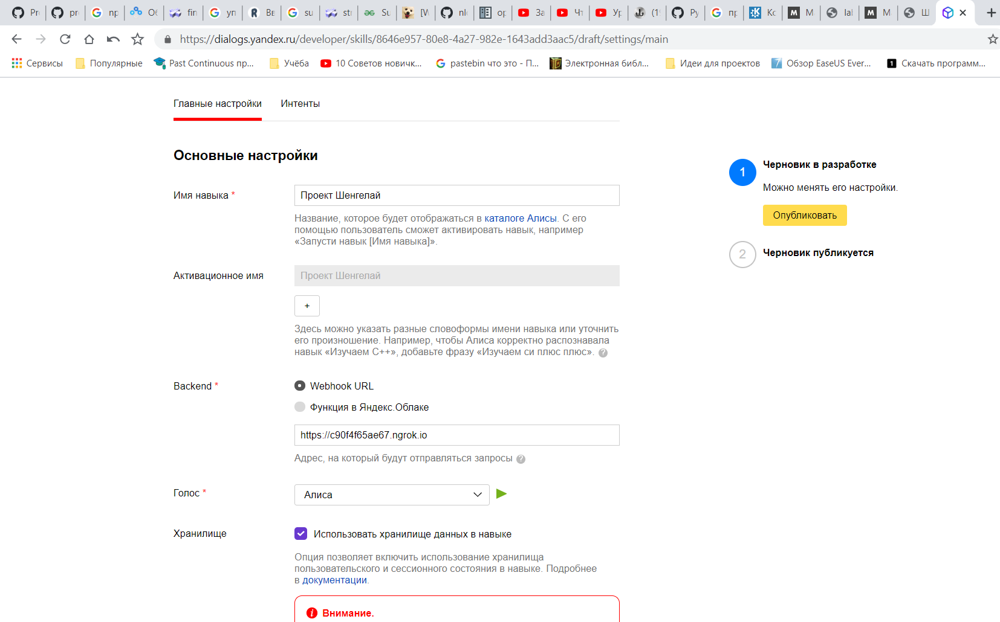
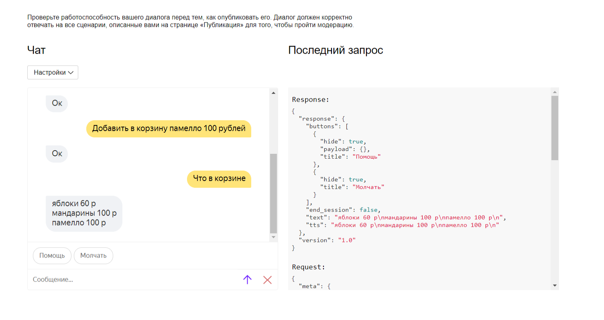
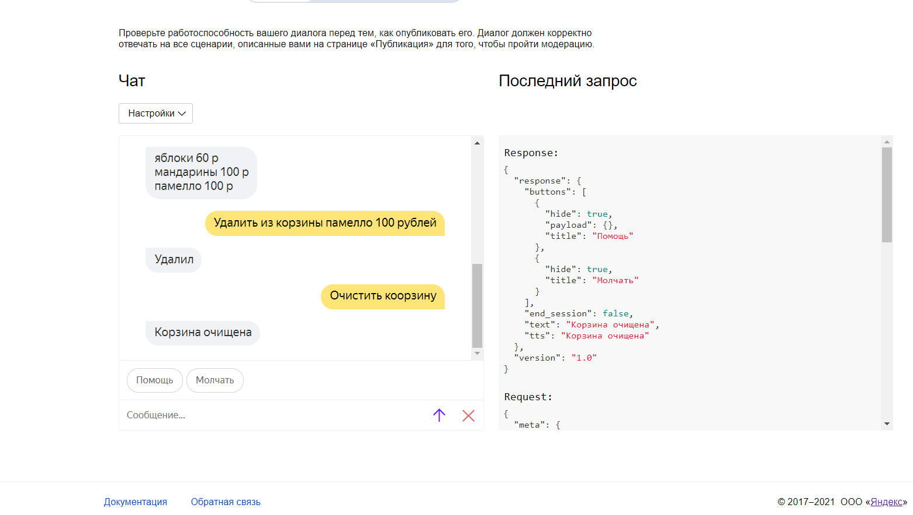
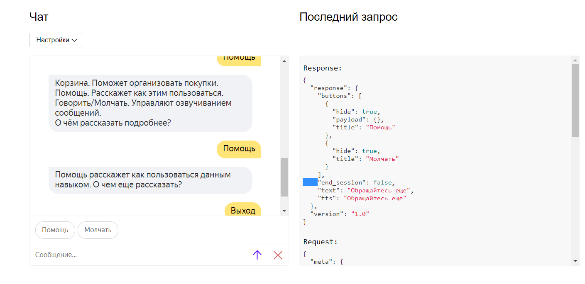

<p align="center">МИНИСТЕРСТВО НАУКИ  И ВЫСШЕГО ОБРАЗОВАНИЯ РОССИЙСКОЙ ФЕДЕРАЦИИ<br>
Федеральное государственное автономное образовательное учреждение высшего образования<br>
"КРЫМСКИЙ ФЕДЕРАЛЬНЫЙ УНИВЕРСИТЕТ им. В. И. ВЕРНАДСКОГО"<br>
ФИЗИКО-ТЕХНИЧЕСКИЙ ИНСТИТУТ<br>
Кафедра компьютерной инженерии и моделирования</p>
<br>
<h3 align="center">Отчёт по лабораторной работе № 1<br> по дисциплине "Программирование"</h3>
<br><br>
<p>студента 1 курса группы ПИ-б-о-201(1)<br>
Шенгелай Всеволод Михайлович<br>
направления подготовки 09.03.04 "Программная инженерия"</p>
<br><br>
<table>
<tr><td>Научный руководитель<br> старший преподаватель кафедры<br> компьютерной инженерии и моделирования</td>
<td>(оценка)</td>
<td>Чабанов В.В.</td>
</tr>
</table>
<br><br>
<p align="center">Симферополь, 2020</p>
<hr>

## Постановка задачи

1. Разработать и зарегистрировать навык для Алисы на сервисе Яндекс.Диалоги;

2. В качестве backend-a для навыка реализовать приложение на языке С++ выполняющее следующие функции:

    1.  Составление продуктовой корзины:
    2. Добавление продукта в корзину;
    3. Удаление продукта из корзины;
    4. Очистка корзины;
    5. Вывод списка товаров в корзине;
    6. Подсчёт стоимости товаров в корзине.
    7. Вывод справочной информации по навыку;
    8. Регистрацию webhook-ов сторонних сервисов;
    9. Отправку данных на сторонние сервисы. 

3. В качестве стороннего сервиса реализовать приложение на языке Python выполняющее следующие функции:
    1. Ожидание данных о покупке;
    2. Сохранение поступивших данных в excel-документ

## Цель лабораторной работы

1. Получить представления о структуре post-запроса;
2. Изучить webhooks как метод взаимодействия web-приложений;

## Выполнение работы

Настраиваем навык согласно указаниям



*Рисунок 1. Настройка навыка помощника покупок*

Далее пишем сервер на С++, который будет формировать ответы навыка

Корзина - json с продуктами, которые мы решили купить




*Рисунок 2. Демонстрация функционаа корзины

Помощь поможет узнать о назначении кнопок



*Рисунок 3. Демонстрация работы функционала Помощь*

Поддержка навыка - не единственная задача сервера. Он также отображает страницу управления webhook-ами.


*Рисунок 4. Скриншот страницы управления webhook-ами с добавленным webhook-ом клиентского приложения*

[Ссылка на excel-файл заполненный клиентским приложением](https://github.com/VsevolodShengelai/Programming/tree/master/Lab/lab2/Python/data.xlsx "Я ссылка")

Полный исходный код серверного приложения

<details>

```C++

#include <iostream>
#include <string>
#include <cpp_httplib/httplib.h>
#include <nlohmann/json.hpp>
#include <map>

typedef std::map<std::string, std::string> new_Map;
using json = nlohmann::json;
using std::cout;
using std::endl;
using std::string;
using std::ifstream;
using std::ofstream;
using namespace httplib;

void gen_response(const Request& req, Response& res);

void replace_all(std::string& html_str, const std::string& raw_arg, const std::string& arg)
{
    size_t position = html_str.find(raw_arg);
    while (position != std::string::npos)
    {
        html_str.replace(position, raw_arg.size(), arg);
        position = html_str.find(raw_arg, position + arg.size());
    }
}

bool is_empty_file(std::ifstream& pFile)
{
    return pFile.peek() == ifstream::traits_type::eof(); // т.е. если мы взяли "конец файла", то вернётся true
}

json CacheGenerator(ifstream& ReadCache)
{
    json RawCache;
    RawCache = u8R"(
{
    "webhooks":[]
}
)"_json;
    ofstream wc("webhooks.json");
    cout << "Generating cache..." << endl;
    wc << std::setw(2) << RawCache << std::endl;

    return RawCache;
}

json CacheReader(ifstream& rc)
{
    json RawCache;
    bool not_exist_cache = !rc.is_open() or is_empty_file(rc);

    if (not_exist_cache)
    {
        RawCache = CacheGenerator(rc);
    }
    else
    {
        rc >> RawCache;
        cout << "Cache succesfully read" << endl;
    }
    return RawCache;
}

string StringReplacer(string FToRemoove, json cache)
{
    if (cache["webhooks"].empty())
    {
        // что заменять
        string s1 = "{webhooks_list}";
        // на что заменять
        string EmptyLine = "";
        // FToRemoove.replace(позиция_начала_замены, сколько_символов_стереть, что_вставить_вместо_стёртого);
        FToRemoove.replace(FToRemoove.find(s1), s1.length(), EmptyLine);
        return FToRemoove;
    }
    else
    {
        string Code_for_hookglob;

        for (int i = 0; i < cache["webhooks"].size(); i++)
        {
            string Code_for_hook;
            ifstream hc("Code_for_hook.html");
            if (hc.is_open()) // если открылся
            {
                getline(hc, Code_for_hook, '\0'); // читаем его содежимое
            }
            else // в противном случае говорим что шаблон не открылся
                cout << "Can`t open Code_for_hook";
            //cout << cache["webhooks"][i]; // Отладочная строка
            string s2 = "{Webhook URL}";
            string repLine = cache["webhooks"][i];

            Code_for_hook.replace(Code_for_hook.find(s2), s2.length(), repLine);
            Code_for_hook.replace(Code_for_hook.find(s2), s2.length(), repLine);

            Code_for_hookglob += Code_for_hook;

            /*ofstream fout("cppstudio.txt", std::ios::app);
            fout << Code_for_hook;
            fout.close();*/

        }

        string s1 = "{webhooks_list}";
        FToRemoove.replace(FToRemoove.find(s1), s1.length(), Code_for_hookglob);

        /*string shit = FToRemoove;
        ofstream out("staba.txt", std::ios::app);
        out << shit;
        out.close();*/
        return FToRemoove;
    }


    //return FToRemoove; // возвращаем готовый HTML
}

void gen_response(const Request& req, Response& res)
{
    ifstream rc("webhooks.json");
    json RawCache = CacheReader(rc);
    //string temp = RawCache;
    //json cache = json::parse(temp);
    rc.close(); // Закрываем файл, отсоединив его от потока

    string widget;
    ifstream rw("Webhooks.html");
    if (rw.is_open()) // если открылся
    {
        getline(rw, widget, '\0'); // читаем его содежимое
    }
    else // в противном случае говорим что шаблон не открылся
        cout << "Can`t open Webhooks cache";
    rw.close();
    // помним что это StringReplacer, который заменяет в строке htmlя шаблонные данные по кэшу
    string output = StringReplacer(widget, RawCache);
    //Сохранение html после обработки отдельным файлом
    //ofstream pg("pogoda.html");
    //pg << std::setw(2) << output << std::endl;
    cout << "we have html \n";


    res.set_content(output, "text/html");
}

void DelHook(json RawCache, string val)
{
    for (int i = 0; i < RawCache["webhooks"].size(); i++)
    {

        if (RawCache["webhooks"][i] == val)
        {
            RawCache["webhooks"].erase(i);
            remove("webhooks.json");
            ofstream wc("webhooks.json");
            cout << "Renewal of cache..." << endl;
            wc << std::setw(2) << RawCache << std::endl;
            wc.close();
        }
        //cout << i << "\n";
    }
}

void AddHook(json RawCache, string val)
{

    RawCache["webhooks"].insert(RawCache["webhooks"].begin(), val);
    //cout << RawCache;
    remove("webhooks.json");
    ofstream wc("webhooks.json");
    cout << "Renewal of cache..." << endl;
    wc << std::setw(2) << RawCache << std::endl;
    wc.close();
}

void gen_response_post(const Request& req, Response& res)
{
    ifstream rc("webhooks.json");
    json RawCache = CacheReader(rc);
    rc.close();
    //std::cout << RawCache;


    if (req.has_param("del")) {
        auto val = req.get_param_value("del");
        DelHook(RawCache, val);

        ifstream rc("webhooks.json");
        json RawCachenew = CacheReader(rc);
        rc.close(); // Закрываем файл, отсоединив его от потока
        //cout << RawCachenew;
        string widget;
        ifstream rw("Webhooks.html");
        if (rw.is_open()) // если открылся
        {
            getline(rw, widget, '\0'); // читаем его содежимое
        }
        else // в противном случае говорим что шаблон не открылся
            cout << "Can`t open Webhooks cache";
        rw.close();
        string output = StringReplacer(widget, RawCachenew);
        //Сохранение html после обработки отдельным файлом
        //ofstream pg("pogoda.html");
        //pg << std::setw(2) << output << std::endl;
        //cout << "we have new html \n";
        res.set_content(output, "text/html");

    }

    else if (req.has_param("set")) {
        auto val = req.get_param_value("set");
        //std::cout << val;
        AddHook(RawCache, val);

        ifstream rc("webhooks.json");
        json RawCachenew = CacheReader(rc);
        rc.close(); // Закрываем файл, отсоединив его от потока
        //cout << RawCachenew;
        string widget;
        ifstream rw("Webhooks.html");
        if (rw.is_open()) // если открылся
        {
            getline(rw, widget, '\0'); // читаем его содежимое
        }
        else // в противном случае говорим что шаблон не открылся
            cout << "Can`t open Webhooks cache";
        rw.close();
        string output = StringReplacer(widget, RawCachenew);
        //Сохранение html после обработки отдельным файлом
        //ofstream pg("pogoda.html");
        //pg << std::setw(2) << output << std::endl;
        //cout << "we have new html \n";
        res.set_content(output, "text/html");


    }

    std::cout << "Req: " << req.body.c_str() << std::endl;

}

json button_speak = { {"title", u8R"(Говори)"}, {"hide", true} };
json button_silent = { {"title", u8R"(Молчать)"},{"hide", true} };
json button_help = { { {"title", u8R"(Помощь)"}, {"payload", json::object()}, {"hide", true} } };
json buttons = json::array();
json session_list;
new_Map session_list_map;
json buttons_to_help = {
                {{"title", u8R"(Молчать)"}, {"payload", json::object()}, {"hide", true}},
                {{"title", u8R"(Говори)"}, {"payload", json::object()}, {"hide", true}},
                {{"title", u8R"(Помощь)"}, {"payload", json::object()}, {"hide", true}},
                {{"title", u8R"(Добавить в корзину)"}, {"payload", json::object()}, {"hide", true}},
                {{"title", u8R"(Удалить из корзины)"}, {"payload", json::object()}, {"hide", true}},
                {{"title", u8R"(Что в корзине)"}, {"payload", json::object()}, {"hide", true}},
                {{"title", u8R"(Очистить корзину)"}, {"payload", json::object()}, {"hide", true}},
                {{"title", u8R"(Сумма)"}, {"payload", json::object()}, {"hide", true}},
                {{"title", u8R"(Покупка завершена)"}, {"payload", json::object()}, {"hide", true}},
                {{"title", u8R"(Выход)"}, {"payload", json::object()}, {"hide", true}}
};

json gen_response_yandex(const std::string& text, const std::string& tts, const json buttons, const std::string session_id, bool end_session = false)
{
    json response = {
        {"response", {
            {"buttons", buttons},
            {"end_session", end_session}
        }},
        {"version", "1.0"}
    };

    if (text != "")
    {
        response["response"]["text"] = text;
    }

    if (!session_id.empty() && end_session == false) {
        if (session_list[session_id]["speak"])
        {
            if (tts != "")
            {
                response["response"]["tts"] = tts;
            }
            if (!session_list[session_id]["help"]) {
                response["response"]["buttons"].push_back(button_silent);
            }
        }
        else if (!session_list[session_id]["speak"] && !session_list[session_id]["help"])
        {
            response["response"]["buttons"].push_back(button_speak);
        }
    }

    //cout << std::setw(2) << response;

    return response;
}

void yandex(const Request& req, Response& res)
{
    json j = json::parse(req.body);
    json answer;

    std::string session_id = j["session"]["session_id"];

    if (j["session"]["new"]) {
        std::string text = u8R"(Здравствуйте! Я помогу вам с покупками.)";
        std::string tts = u8R"(Здр+авствуйте! Я помогу вам с пок+упками.)";

        session_list_map.emplace(session_id, "1");
        session_list[session_id] = json::object();
        session_list[session_id]["speak"] = true;
        session_list[session_id]["help"] = false;
        session_list[session_id]["sum"] = "0";
        session_list[session_id]["cart"] = json::array();

        answer = gen_response_yandex(text, tts, button_help, session_id);
        res.set_content(answer.dump(), "text/json; charset=UTF-8");
    }
    else {
        bool breaking = true;
        for (auto session : session_list_map)
        {
            if (session.first == session_id)
            {
                breaking = false;
            }
        }
        if (breaking) {
            std::string text = u8R"(Ошибка, данные не корректны. Попробуйте еще раз.)";
            answer = gen_response_yandex(text, text, button_help, session_id, true);
            res.set_content(answer.dump(), "text/json; charset=UTF-8");
        }
        if (j["request"]["nlu"]["tokens"][0] == u8"молчать") {
            if (!session_list[session_id]["help"]) {
                session_list[session_id]["speak"] = false;
                std::string text = u8R"(Озвучка сообщений отключена)";
                answer = gen_response_yandex(text, text, button_help, session_id);
                res.set_content(answer.dump(), "text/json; charset=UTF-8");
            }
            else {
                std::string text = u8R"(Вызовите эту команду чтобы отключить озвучку сообщений. О чем еще рассказать?)";
                answer = gen_response_yandex(text, text, buttons_to_help, session_id);
                res.set_content(answer.dump(), "text/json; charset=UTF-8");
            }
        }
        else if (j["request"]["nlu"]["tokens"][0] == u8"помощь") {
            if (!session_list[session_id]["help"]) {
                session_list[session_id]["help"] = true;
                std::string text = u8R"(Корзина. Поможет организовать покупки.
					Помощь. Расскажет как этим пользоваться.
					Говорить/Молчать. Управляют озвучиванием сообщений.
					О чём рассказать подробнее?)";
                answer = gen_response_yandex(text, text, buttons_to_help, session_id);
                res.set_content(answer.dump(), "text/json; charset=UTF-8");
            }
            else {
                std::string text = u8R"(Помощь расскажет как пользоваться данным навыком. О чем еще рассказать?)";
                answer = gen_response_yandex(text, text, buttons_to_help, session_id);
                res.set_content(answer.dump(), "text/json; charset=UTF-8");
            }
        }
        else if (j["request"]["nlu"]["tokens"][0] == u8"говори") {
            if (!session_list[session_id]["help"]) {
                session_list[session_id]["speak"] = true;
                std::string text = u8R"(Озвучка сообщений включена)";
                answer = gen_response_yandex(text, text, button_help, session_id);
                res.set_content(answer.dump(), "text/json; charset=UTF-8");
            }
            else {
                std::string text = u8R"(Вызовите эту команду чтобы включить озвучку сообщений. О чем еще рассказать?)";
                answer = gen_response_yandex(text, text, buttons_to_help, session_id);
                res.set_content(answer.dump(), "text/json; charset=UTF-8");
            }
        }
        else if (j["request"]["nlu"]["tokens"][0] == u8"покупка") {
            if (!session_list[session_id]["help"]) {
                std::string text = u8R"(Заходите ещё)";

                //std::ofstream logger("log.txt");
                //logger << session_list << std::endl;

                // Код, отвечающий за отсылку ответов
                json check = json::array();

                for (int i = 0; i < session_list[session_id]["cart"].size(); i++)
                {
                    string value = session_list[session_id]["cart"][i];
                    int index_tech = value.find(' ', 0);
                    string item = value.substr(0, index_tech);
                    int index_tech2 = value.find(' ', index_tech);
                    string price = value.substr(index_tech, index_tech2);

                    cout << item << endl;
                    cout << price << endl;

                    json jsn;
                    jsn["item"] = item;
                    jsn["price"] = price;

                    check.push_back(jsn);
                    std::ofstream logger("log.txt");
                    logger << value << endl;
                    logger << check << item << price << std::endl;
                    logger << index_tech << " " << index_tech2;
                }

                json output =
                {
                    {"user_id", session_id},
                    {"check", check}
                };

                ifstream rc("webhooks.json");
                json RawCache = CacheReader(rc);
                rc.close();

                for (std::string link : RawCache["webhooks"])
                {
                    // https не работает, заменяем на http
                    replace_all(link, "https://", "http://");

                    // "http://" length
                    const int http_length = 7;

                    int index = link.find('/', http_length);

                    if (index == std::string::npos)
                    {
                        link.push_back('/');
                    }

                    index = link.find('/', http_length);

                    cout << index << endl;
                    cout << link << endl;
                    cout << link.substr(0, index).c_str() << endl;
                    cout << link.substr(index, std::string::npos).c_str() << endl << endl;

                    Client cli(link.substr(0, index).c_str());
                    cli.Post(link.substr(index, std::string::npos).c_str(), output.dump(2), "application/json; charset=UTF-8");
                }

                answer = gen_response_yandex(text, text, button_help, session_id);
                //std::ofstream logger("log.txt");
                //logger << answer << std::endl;

                res.set_content(answer.dump(), "text/json; charset=UTF-8");

            }
            else {
                std::string text = u8R"(Эта команда завершает покупку. О чем еще рассказать?)";
                answer = gen_response_yandex(text, text, buttons_to_help, session_id);
                res.set_content(answer.dump(), "text/json; charset=UTF-8");
            }
        }
        else if (j["request"]["nlu"]["tokens"][0] == u8"что") {
            if (!session_list[session_id]["help"]) {
                std::string text;
                for (auto item_old : session_list[session_id]["cart"]) {
                    text += item_old;
                    text += "\n";
                }
                if (text.empty()) {
                    text = u8R"(Корзина пуста, Вы ничего не добавили)";
                }
                answer = gen_response_yandex(text, text, button_help, session_id);
                res.set_content(answer.dump(), "text/json; charset=UTF-8");
            }
            else {
                std::string text = u8R"(Вызовите эту команду чтобы узнать содержимое Вашей корзины. О чем еще рассказать?)";
                answer = gen_response_yandex(text, text, buttons_to_help, session_id);
                res.set_content(answer.dump(), "text/json; charset=UTF-8");
            }
        }
        else if (j["request"]["nlu"]["tokens"][0] == u8"добавить") {
            if (!session_list[session_id]["help"]) {
                std::string good_name = j["request"]["nlu"]["tokens"][3];
                std::string good_price = j["request"]["nlu"]["tokens"][4];
                std::string good_val = j["request"]["nlu"]["tokens"][5];
                std::string good = good_name + " " + good_price + " " + good_val;

                session_list[session_id]["cart"].push_back(good);

                std::string s = session_list[session_id]["sum"];
                int a = std::stoi(s);
                int i = std::stoi(good_price);
                session_list[session_id]["sum"] = std::to_string(a + i);

                std::string text = u8R"(Ок)";
                answer = gen_response_yandex(text, text, button_help, session_id);
                res.set_content(answer.dump(), "text/json; charset=UTF-8");
            }
            else {
                std::string text = u8R"(Вызовите эту команду чтобы добавить товар в корзину (шаблон: Добавить в корзину "товар" "цена"). О чем еще рассказать?)";
                answer = gen_response_yandex(text, text, buttons_to_help, session_id);
                res.set_content(answer.dump(), "text/json; charset=UTF-8");
            }
        }
        else if (j["request"]["nlu"]["tokens"][0] == u8"удалить") {
            if (!session_list[session_id]["help"]) {
                std::string item_name = j["request"]["nlu"]["tokens"][3];
                std::string item_price = j["request"]["nlu"]["tokens"][4];
                std::string item_val = j["request"]["nlu"]["tokens"][5];
                std::string item = item_name + " " + item_price + " " + item_val;
                bool exists = false;


                json arr = json::array();
                for (auto item_old : session_list[session_id]["cart"]) {
                    if (item != item_old) {
                        arr.push_back(item_old);
                    }
                    else {
                        exists = true;
                    }
                }
                session_list[session_id]["cart"] = arr;

                std::string s = session_list[session_id]["sum"];
                int a = std::stoi(s);
                int i = std::stoi(item_price);
                session_list[session_id]["sum"] = std::to_string(a - i);
                std::string text;
                if (exists) {
                    text = u8R"(Удалил)";
                }
                else
                {
                    text = u8R"(Такого продукта нет)";
                }

                answer = gen_response_yandex(text, text, button_help, session_id);
                res.set_content(answer.dump(), "text/json; charset=UTF-8");
            }
            else {
                std::string text = u8R"(Вызовите эту команду чтобы удалить товар из корзины (шаблон: Удалить из корзины "товар" "цена"). О чем еще рассказать?)";
                answer = gen_response_yandex(text, text, buttons_to_help, session_id);
                res.set_content(answer.dump(), "text/json; charset=UTF-8");
            }
        }
        else if (j["request"]["nlu"]["tokens"][0] == u8"очистить") {
            if (!session_list[session_id]["help"]) {
                session_list[session_id]["cart"] = json::array();
                std::string text = u8R"(Корзина очищена)";
                session_list[session_id]["sum"] = "0";
                answer = gen_response_yandex(text, text, button_help, session_id);
                res.set_content(answer.dump(), "text/json; charset=UTF-8");
            }
            else {
                std::string text = u8R"(Вызовите эту команду для очистки корзину. О чем еще рассказать?)";
                answer = gen_response_yandex(text, text, buttons_to_help, session_id);
                res.set_content(answer.dump(), "text/json; charset=UTF-8");
            }
        }
        else if (j["request"]["nlu"]["tokens"][0] == u8"сумма") {
            if (!session_list[session_id]["help"]) {
                std::string s = session_list[session_id]["sum"];
                std::string text = u8R"(Сумма Вашей покупки )" + s + u8R"( рублей)";
                answer = gen_response_yandex(text, text, button_help, session_id);
                res.set_content(answer.dump(), "text/json; charset=UTF-8");
            }
            else {
                std::string text = u8R"(Вызови эту команду чтобы узнать сумму Вашей покупки. О чем еще рассказать?)";
                answer = gen_response_yandex(text, text, buttons_to_help, session_id);
                res.set_content(answer.dump(), "text/json; charset=UTF-8");
            }
        }
        else if (j["request"]["nlu"]["tokens"][0] == u8"выход") {
            session_list[session_id]["help"] = false;
            std::string text = u8R"(Обращайтесь еще)";
            answer = gen_response_yandex(text, text, button_help, session_id);
            res.set_content(answer.dump(), "text/json; charset=UTF-8");
        }
        else {
            std::string text = u8R"(Не могу понять команду, попробуйте еще)";
            answer = gen_response_yandex(text, text, button_help, session_id);
            res.set_content(answer.dump(), "text/json; charset=UTF-8");
        }
    }
}

int main() {
    Server svr;                            // Создаём сервер (пока-что не запущен)
    svr.Get("/webhooks", gen_response);
    svr.Post("/webhooks", gen_response_post);
    svr.Post("/", yandex);
    // svr.Post("/", gen_response);           // Вызвать функцию gen_response на post запрос
    std::cout << "Start server... OK\n"; // cout использовать нельзя
    svr.listen("localhost", 1234);         // Запускаем сервер на localhost и порту 1234

}
```
</details>

5. Исходный код Клиентского приложения
 

<details>


```python

from flask import Flask, request
import json
import datetime
import openpyxl
import os.path

app = Flask(__name__)


def write_xls():
    global max_line, buff

    book = openpyxl.load_workbook('data.xlsx')
    sheet = book.active

    for raw in buff:
        for i in range(5):
            sheet.cell(max_line, i + 1).value = raw[i]
        max_line += 1

    book.save('data.xlsx')
    book.close

    buff.clear()


@app.route('/', methods=['POST'])
def index():
    global buff, max_id
    req_json = request.get_json()
    req_time = datetime.datetime.now().time()

    for it in req_json['check']:
        raw = [max_id, req_json['user_id'], req_time, it['item'], it['price']]
        max_id += 1
        print(raw)
        buff.append(raw)

    if len(buff) > 0:
        write_xls()

    return '0'


if __name__ == "__main__":
    global buff, max_id, max_line
    buff = []
    max_id = 1
    max_line = 2


if not os.path.exists('data.xlsx'):
    book = openpyxl.Workbook()
    sheet = book.active

    sheet['A1'].value = 'N'
    sheet['B1'].value = 'User ID'
    sheet['C1'].value = 'Datetime'
    sheet['D1'].value = 'Item'
    sheet['E1'].value = 'Prise'

    book.save('data.xlsx')
    book.close


app.run()

```
</details>
<br>


## Вывод

В процессе выполнения работы я закрепил свои навыки работы с json, получил представление о работе webhook`ов