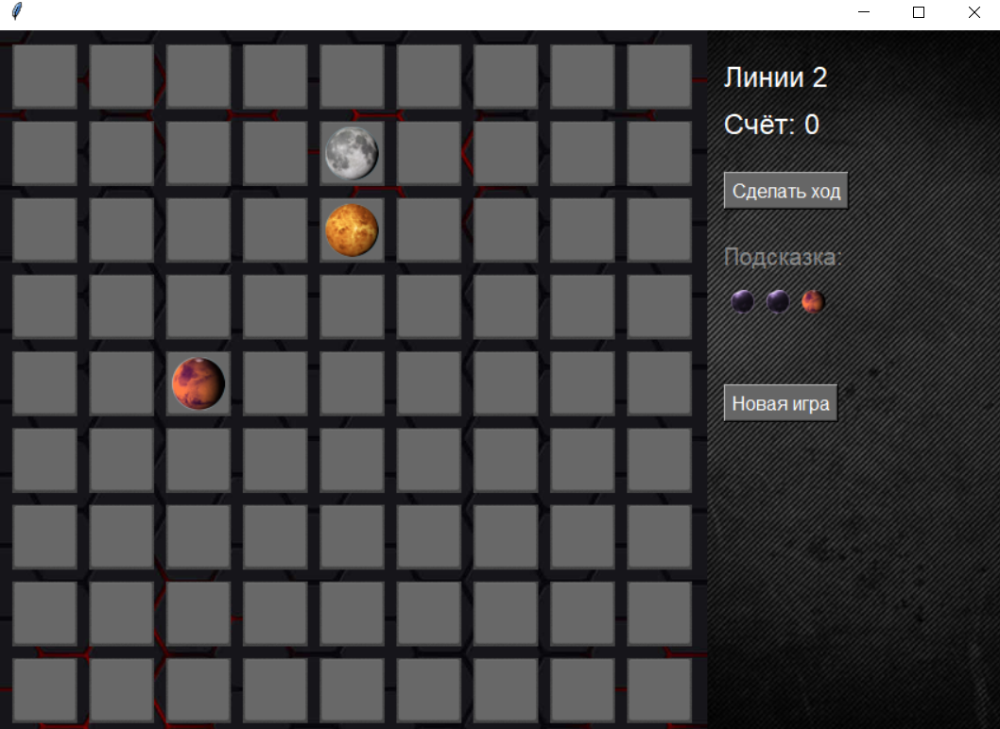
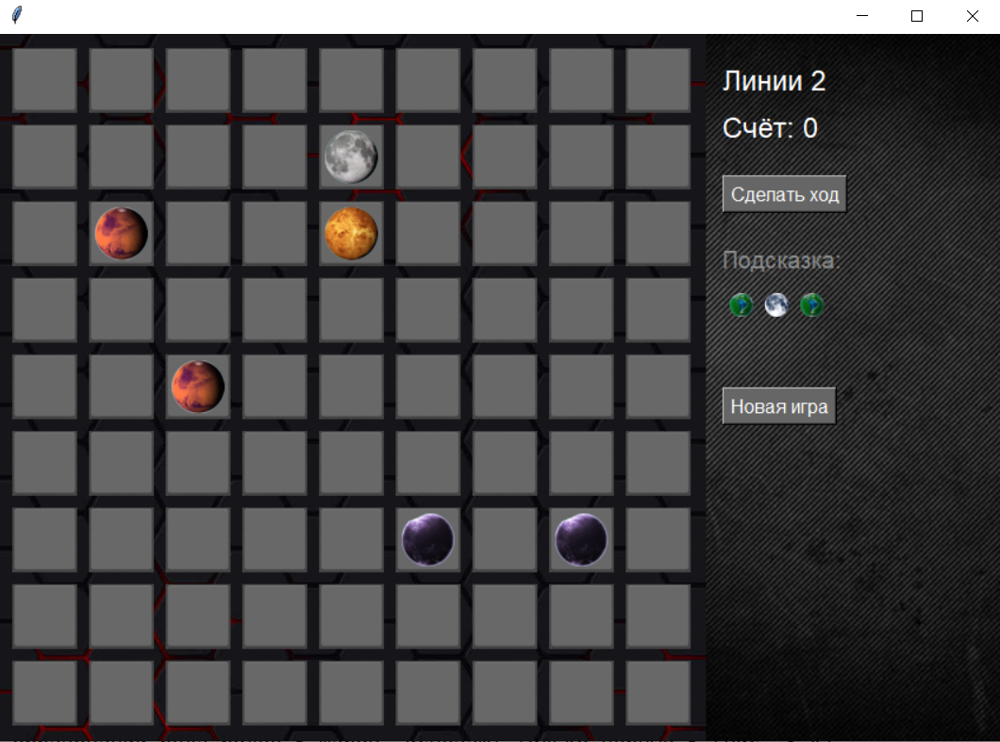

<p align="center">МИНИСТЕРСТВО НАУКИ  И ВЫСШЕГО ОБРАЗОВАНИЯ РОССИЙСКОЙ ФЕДЕРАЦИИ<br>
Федеральное государственное автономное образовательное учреждение высшего образования<br>
"КРЫМСКИЙ ФЕДЕРАЛЬНЫЙ УНИВЕРСИТЕТ им. В. И. ВЕРНАДСКОГО"<br>
ФИЗИКО-ТЕХНИЧЕСКИЙ ИНСТИТУТ<br>
Кафедра компьютерной инженерии и моделирования</p>
<br>
<h3 align="center">Отчёт по лабораторной работе № 3<br> по дисциплине "Программирование"</h3>
<br><br>
<p>студента 1 курса группы ПИ-б-о-201(1)<br>
Шенгелай Всеволода Михаловича<br>
направления подготовки 09.03.04 "Программная инженерия"</p>
<br><br>
<table>
<tr><td>Научный руководитель<br> старший преподаватель кафедры<br> компьютерной инженерии и моделирования</td>
<td>(оценка)</td>
<td>Чабанов В.В.</td>
</tr>
</table>
<br><br>
<p align="center">Симферополь, 2020</p>
<hr>

## Цель:

1. Закрепить навыки разработки программ с простым графическим интерфейсом пользователя на зыке Python при помощи библиотеки Tkinter;
2. Получить представление о разработке простых игровых приложений.

## Постановка задачи
1. Используя стандартный модуль для разработки программ с графическим интерфейсом Tkinter реализуйте игру Lines на зыке Python.
2. В качестве образца графического интерфейса использовать игру-пример.

## Выполнение работы
В ходе выполнения работы была создана игра "Lines" (Рис. 1).


<p align="center">
Рисунок 1 - Начало игры
</p>

После каждого хода на поле добавляются 3 новых шара (Рис. 2).


<p align="center">
Рисунок 2 - добавление шаров после хода
</p>

При образовании ряда более 5 шаров, исчезают только первые 5 (отсчёт слева-сверху)

При отсутствии свободных полей игра заканчивается

Исходный код приложения:
```Python
from tkinter import *


import math

from PIL import ImageTk, Image
import random

root = Tk()
root.title("")

images_balls = {
        
        "ball-red": Image.open("img/ball-red.png").convert('RGBA'),

        "ball-green": Image.open("img/ball-green.png").convert('RGBA'),
   
        "ball-violet": Image.open("img/ball-violet.png").convert('RGBA'),

        "ball-yellow": Image.open("img/ball-yellow.png").convert('RGBA'),

        "ball-grey": Image.open("img/ball-grey.png").convert('RGBA'),

        "ball-lightblue": Image.open("img/ball-lightblue.png").convert('RGBA')
}

images_balls_small = {
        
        "ball-red": ImageTk.PhotoImage(file="img/ball-red-small.png"),

        "ball-green": ImageTk.PhotoImage(file="img/ball-green-small.png"),
   
        "ball-violet": ImageTk.PhotoImage(file="img/ball-violet-small.png"),

        "ball-yellow": ImageTk.PhotoImage(file="img/ball-yellow-small.png"),

        "ball-grey": ImageTk.PhotoImage(file="img/ball-grey-small.png"),

        "ball-lightblue": ImageTk.PhotoImage(file="img/ball-lightblue-small.png")
}
back = PhotoImage(file="damaged_metal_orig.2.png")
interface =PhotoImage(file="imgonline-com-ua-Resize-RbmtiTZkMPDM.png")

'''cell_bg_dark  = Image.open("img/cell-bgr_pressed.png").convert('RGBA')'''

images_balls_names = ["ball-red","ball-green","ball-violet", "ball-yellow", "ball-grey", "ball-lightblue"]

#Описание полотна для пульта управления
canvas2 = Canvas(root, width = 600, height = 600,
                bg = 'blue', bd = 0,
                borderwidth = 0,
                highlightthickness = 0) 
canvas2.grid(row=0, column=0, pady=0)
canvas2.create_image(0, 0, image = interface, anchor = NW)

#Это Canvas для самой игры
canvas = Canvas(root, width = 250, height = 600,
                bg = 'blue', bd = 0,
                borderwidth = 0,
                highlightthickness = 0) 
canvas.grid(row=0, column=1, pady=0)

canvas.create_image(0, 0, image = back, anchor = NW)


gameover = None

pixel_coord_array = []
start_x = 12
start_y = 12

# По строке и столбцу можно найти пиксели для размещения объекта
for row in range(9):
            rowarray = []
            start_x = 12
            
            for col in range(9):
                rowarray.append([start_x, start_y])
                start_x +=65
            pixel_coord_array.append(rowarray)
            start_y += 65
            del rowarray
#print(pixel_coord_array)


def gameinit():
    global gameover
    if gameover == True:
        pass #Убирается надпись "Игра окончена"
    global global_ball_buffer
    global ball_buffer
    # Заполним массив шариков пустыми значениями
    global array_of_balls


    
    global_ball_buffer = []
    ball_buffer = []
    array_of_balls = []
    for row in range(9):
            rowarray = []
            for col in range(9):
                rowarray.append({'row': row, 'col': col, 'ball': None, 'Backlight' : None})
            array_of_balls.append(rowarray)
            del rowarray
         #print (array_of_balls)
    #Игровое поле очищается от шариков;
    #Все плитки игрового поля становятся вида: плитка не выбрана (стандартный);
    #Выбранного шарика нет;
    global linecount
    linecount = 0#Счёт равен нулю;
    AddBalls_on_playing_field()#Выполнение действия Добавление шариков на игровое поле.
    #Игра переходит в состояние Шарик не выбран;
def display_the_balls():
    start_x = 12
    start_y = 12
    buffcount = 0
    for row in range(9):
        for col in range(9):
            global lbl

            if array_of_balls[row][col]['ball'] == None:
                cell_bg = Image.open("img/cell-bgr.png").convert('RGBA')
                cell_bg = ImageTk.PhotoImage(cell_bg)
                cell_arrayyy.append(cell_bg)

                lbl = Label(canvas2,
                            text=', '.join([str(row), str(col)]),
                            bg="sky blue", 
                            borderwidth = 0, image = cell_bg)
                lbl.row = row
                lbl.col = col
                lbl.ball = array_of_balls[row][col]['ball']      
                lbl.bind("<Button-1>", label_pressed)
            else:
                ##print (buffcount)
                
                cell_bg = Image.open("img/cell-bgr.png").convert('RGBA')
                cell_bg.paste(images_balls[array_of_balls[row][col]['ball']] ,   # Накладываемая картинка
                              (5,5),  # Сместить картинку на (x, y) пикселей
                               images_balls[array_of_balls[row][col]['ball']])
                cell_bg = ImageTk.PhotoImage(cell_bg)
                cell_arrayyy.append(cell_bg)

                
                
                lbl = Label(canvas2,
                            text=', '.join([str(row), str(col)]),
                            bg="sky blue", 
                            borderwidth = 0, image = cell_bg)
                lbl.row = row
                lbl.col = col
                lbl.ball = array_of_balls[row][col]['ball']      
                lbl.bind("<Button-1>", label_pressed)
            
            if col < 8:
            
                lbl_window = canvas2.create_window(start_x, start_y, anchor=NW, window=lbl)
                start_x += 65
            
            if col == 8:
            
                lbl_window = canvas2.create_window(start_x, start_y, anchor=NW, window=lbl)
                start_x = 12
                start_y += 65   
    

Ball_was_choosen = {'row': 0, 'col': 0, 'bool': False} #Страховочная инициализация
def label_pressed(event):
    global array_of_balls
    global cell_arrayyy
    global Ball_was_choosen
    print(event.widget.row, event.widget.col)
    if event.widget.ball != None:
        for row in range(9):
             for col in range(9):
                 array_of_balls[row][col]['Backlight'] = None
        Ball_was_choosen = {'row': event.widget.row, 'col': event.widget.col, 'bool': False}
        array_of_balls[event.widget.row][event.widget.col]['Backlight'] = [True]
        start_x = 12
        start_y = 12         
        for row in range(9):     
          for col in range(9):
            global lbl

            if array_of_balls[row][col]['ball'] == None:
                cell_bg = Image.open("img/cell-bgr.png").convert('RGBA')
                cell_bg = ImageTk.PhotoImage(cell_bg)
                cell_arrayyy.append(cell_bg)

                lbl = Label(canvas2,
                            text=', '.join([str(row), str(col)]),
                            bg="sky blue", 
                            borderwidth = 0, image = cell_bg)
                lbl.row = row
                lbl.col = col
                lbl.ball = array_of_balls[row][col]['ball']      
                lbl.bind("<Button-1>", label_pressed)
            else:

                if array_of_balls[row][col]['Backlight'] == None:
                    cell_bg = Image.open("img/cell-bgr.png").convert('RGBA')
                else:
                    cell_bg = Image.open("img/cell-bgr_pressed.png").convert('RGBA')
                cell_bg.paste(images_balls[array_of_balls[row][col]['ball']] ,   # Накладываемая картинка
                              (5,5),  # Сместить картинку на (x, y) пикселей
                               images_balls[array_of_balls[row][col]['ball']])
                cell_bg = ImageTk.PhotoImage(cell_bg)
                cell_arrayyy.append(cell_bg)

                
                
                lbl = Label(canvas2,
                            text=', '.join([str(row), str(col)]),
                            bg="sky blue", 
                            borderwidth = 0, image = cell_bg)
                lbl.row = row
                lbl.col = col
                lbl.ball = array_of_balls[row][col]['ball']      
                lbl.bind("<Button-1>", label_pressed)
            
            if col < 8:
            
                lbl_window = canvas2.create_window(start_x, start_y, anchor=NW, window=lbl)
                start_x += 65
            
            if col == 8:
            
                lbl_window = canvas2.create_window(start_x, start_y, anchor=NW, window=lbl)
                start_x = 12
                start_y += 65
        Ball_was_choosen = {'row': event.widget.row, 'col': event.widget.col, 'bool': True}
    elif Ball_was_choosen['bool']:
        None_was_choosen = {'row': event.widget.row, 'col': event.widget.col}
        print(Ball_was_choosen)
        print(None_was_choosen)
        makemove(Ball_was_choosen, None_was_choosen)
        
def makemove(Ball_was_choosen, None_was_choosen):
    global array_of_balls

    maze = []
    Arow = None_was_choosen['row']
    Acol = None_was_choosen['col']
    for row in range(9):
            rowarray = ""
            for col in range(9):
                ball = array_of_balls[row][col]['ball']
                if Arow == row and Acol == col:
                    rowarray += "A"
                    continue
                if ball == None:
                    rowarray += " "
                else:
                    rowarray += "#"
            maze.append(rowarray)

    
    def MakeMatrix(maze):
        Matrix = []
        lst = []
        for i in range(len(maze)):
           lst = list(maze[i])

           Matrix.append(lst)

        # Выведу все элементы матрицы для себя

        for i in range ( len(Matrix) ): 
          for j in range ( len(Matrix[i]) ): 
              print ( Matrix[i][j], end = "" ) 
          print ('')
        print ('')

        return Matrix
        
    def isOnBoard(x, y, Matrix):
        # Вернуть True, если координаты есть на игровом поле.
        return x >= 0 and x < len(Matrix) and y >= 0 and y < len(Matrix[x])

    def getPlayerMove(Matrix):
        # Позволить игроку ввести свой ход.
        # Вернуть ход.

        while True:
            print('Укажите ход')
            
            x = Ball_was_choosen['row']
            print(Ball_was_choosen['row'])
            y = Ball_was_choosen['col']
            print(Ball_was_choosen['col'])
            if isOnBoard(x, y, Matrix):
                print('Нормальные координаты')
                flag = 1
                return x, y, flag
            else:
                print('Не верные координаты')
                flag = 0
                return x, y, flag

    def MakeMove(x, y):
            global Previos
    
            for xdirection, ydirection in [[0, 1], [1, 0], [0, -1], [-1, 0]]:

                x1 = x + xdirection # Первый шаг в направлении x
                y1 = y + ydirection # Первый шаг в направлении y

                #Фича для разраба
                #print([x1,y1],Matrix[x1][y1])

                if isOnBoard(x1, y1, Matrix) and [x1,y1] not in Previos:
                    if Matrix[x1][y1] != '#':
                        if Matrix[x1][y1] != ' ':
                            Exit.append(Matrix[x1][y1])
                            Previos.append([x1,y1])
                        else:
                            Previos.append([x1,y1])
                            #cuteCOORD.append([x1,y1])
                            MakeMove(x1, y1)


    Matrix = MakeMatrix(maze)

    x, y, flag = getPlayerMove(Matrix)
    if flag == 0:
        sys.exit()

    print('Размер матрицы:',len(Matrix),'строк', len(Matrix[x]),'столбцов\n')

    Exit = []
    global Previos
    Previos = []
    #cuteCOORD = []

    MakeMove(x, y)
    array_of_balls
    for i in Exit: print(i,' ',end = '')

    print(array_of_balls[Ball_was_choosen['row']][Ball_was_choosen['col']]['ball'])
    if Exit != []:
       
        per = array_of_balls[Ball_was_choosen['row']][Ball_was_choosen['col']]['ball']
        array_of_balls[Ball_was_choosen['row']][Ball_was_choosen['col']]['ball'] = array_of_balls[None_was_choosen['col']][None_was_choosen['row']]['ball']
        array_of_balls[None_was_choosen['row']][None_was_choosen['col']]['ball'] = per 
        display_the_balls()
        AddBalls_on_playing_field()
    return 0            

def Check_the_lines():
    pass
    

cell_arrayyy = []
def AddBalls_on_playing_field():
    if ball_buffer == []:
        for i in range(3):
            color = random.randint(0, len(images_balls_names)-1)


            ball_buffer.append(images_balls_names[color])
            #print(ball_buffer)
            global global_ball_buffer
            global_ball_buffer = global_ball_buffer + ball_buffer
            
    global_ball_buffer = global_ball_buffer + ball_buffer
    #Формируем массив координат свободных ячеек
    for num in range(3):
        free_coord_array = []
        for row in range(9):
            for col in range(9):
                ball_color = array_of_balls[row][col]['ball']
                if ball_color == None:
                    free_coord_array.append([array_of_balls[row][col]['row'], array_of_balls[row][col]['col']])
        chsn_crd = random.randint(0, len(free_coord_array)-1)
        array_of_balls[free_coord_array[chsn_crd][0]][free_coord_array[chsn_crd][1]]['ball'] = ball_buffer[num]

    
    ##print(free_coord_array)
    #print(chsn_crd)
    #print(free_coord_array[chsn_crd][0], free_coord_array[chsn_crd][1])
    #print(array_of_balls[free_coord_array[chsn_crd][0]][free_coord_array[chsn_crd][1]]['ball'])                   
    ##print(array_of_balls)
            
    print(ball_buffer)
    start_x = 12
    start_y = 12
    buffcount = 0
    for row in range(9):
        for col in range(9):
            global lbl

            if array_of_balls[row][col]['ball'] == None:
                cell_bg = Image.open("img/cell-bgr.png").convert('RGBA')
                cell_bg = ImageTk.PhotoImage(cell_bg)
                cell_arrayyy.append(cell_bg)

                lbl = Label(canvas2,
                            text=', '.join([str(row), str(col)]),
                            bg="sky blue", 
                            borderwidth = 0, image = cell_bg)
                lbl.row = row
                lbl.col = col
                lbl.ball = array_of_balls[row][col]['ball']      
                lbl.bind("<Button-1>", label_pressed)
            else:
                ##print (buffcount)
                
                cell_bg = Image.open("img/cell-bgr.png").convert('RGBA')
                cell_bg.paste(images_balls[array_of_balls[row][col]['ball']] ,   # Накладываемая картинка
                              (5,5),  # Сместить картинку на (x, y) пикселей
                               images_balls[array_of_balls[row][col]['ball']])
                cell_bg = ImageTk.PhotoImage(cell_bg)
                cell_arrayyy.append(cell_bg)
                buffcount += 1
                
                
                lbl = Label(canvas2,
                            text=', '.join([str(row), str(col)]),
                            bg="sky blue", 
                            borderwidth = 0, image = cell_bg)
                lbl.row = row
                lbl.col = col
                lbl.ball = array_of_balls[row][col]['ball']      
                lbl.bind("<Button-1>", label_pressed)
            
            if col < 8:
            
                lbl_window = canvas2.create_window(start_x, start_y, anchor=NW, window=lbl)
                start_x += 65
            
            if col == 8:
            
                lbl_window = canvas2.create_window(start_x, start_y, anchor=NW, window=lbl)
                start_x = 12
                start_y += 65
                
    ball_buffer.clear()
    for i in range(3):
       color = random.randint(0, len(images_balls_names)-1)

       ball_buffer.append(images_balls_names[color])
    #print(ball_buffer)\
    canvas.create_image(20, 220, image = images_balls_small[ball_buffer[0]], anchor = NW)
    canvas.create_image(50, 220, image = images_balls_small[ball_buffer[1]], anchor = NW)
    canvas.create_image(80, 220, image = images_balls_small[ball_buffer[2]], anchor = NW)    


gameinit()
#cell_arrayyy.clear()

def check_of_lines():
    pass


#menu

canvas.create_text(14, 40, text="Линии 2",
                   font=("Arial", 18), fill="white", anchor=W)
canvas.create_text(14, 80, text="Счёт: 0",
                   font=("Arial", 18), fill="white", anchor=W)
Makemove_Button = Button(canvas, text='Сделать ход', font=("Arial", 12), fg='white', bg='#666666',
                         activebackground='#777777',activeforeground='white',
                         command = AddBalls_on_playing_field)
Makemove_Button_window = canvas.create_window(14, 120, anchor=NW,
                                              window=Makemove_Button )

canvas.create_text(14, 180, text="Подсказка:", font=("Arial", 15), fill="#888888", anchor=NW)

NewgameButton = Button(canvas, text='Новая игра', font=("Arial", 12), fg='white',
                       bg='#666666', activebackground='#777777',
                       activeforeground='white')
NewgameButton_window = canvas.create_window(14, 300, anchor=NW, window=NewgameButton)

root.mainloop()
    
    


```

## Вывод по работе. 
Для достижения поставленной цели были выполнены все поставленные задачи, а именно:

	1) Закреплены навыки разработки программ с графическим интерфейсом Tkinter;
	2) Создана игра Lines с использованием графического интерфейса Tkinter.
	