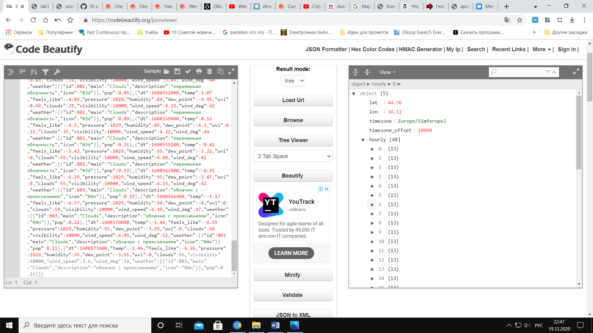
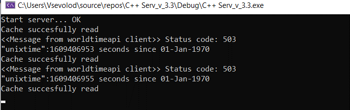
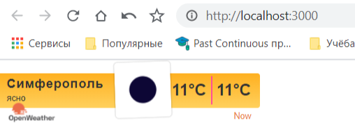
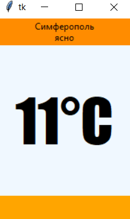

<p align="center">МИНИСТЕРСТВО НАУКИ  И ВЫСШЕГО ОБРАЗОВАНИЯ РОССИЙСКОЙ ФЕДЕРАЦИИ<br>
Федеральное государственное автономное образовательное учреждение высшего образования<br>
"КРЫМСКИЙ ФЕДЕРАЛЬНЫЙ УНИВЕРСИТЕТ им. В. И. ВЕРНАДСКОГО"<br>
ФИЗИКО-ТЕХНИЧЕСКИЙ ИНСТИТУТ<br>
Кафедра компьютерной инженерии и моделирования</p>
<br>
<h3 align="center">Отчёт по лабораторной работе № 1<br> по дисциплине "Программирование"</h3>
<br><br>
<p>студента 1 курса группы ПИ-б-о-201(1)<br>
Шенгелай Всеволод Михайлович<br>
направления подготовки 09.03.04 "Программная инженерия"</p>
<br><br>
<table>
<tr><td>Научный руководитель<br> старший преподаватель кафедры<br> компьютерной инженерии и моделирования</td>
<td>(оценка)</td>
<td>Чабанов В.В.</td>
</tr>
</table>
<br><br>
<p align="center">Симферополь, 2020</p>
<hr>

## Постановка задачи

Разработать сервис предоставляющий данные о погоде в городе Симферополе на момент запроса. В качестве источника данных о погоде используйте: http://openweathermap.org/. В состав сервиса входит: серверное приложение на языке С++ и клиентское приложение на языке Python.

Серверное приложение (далее Сервер) предназначенное для обслуживания клиентских приложений и минимизации количества запросов к сервису openweathermap.org. Сервер должен обеспечивать возможность получения данных в формате JSON и виде html виджета (для вставки виджета на страницу будет использоваться iframe).

Клиентское приложение должно иметь графический интерфейс отображающий сведения о погоде и возможность обновления данных по требованию пользователя.

## Цель лабораторной работы

- Закрепить навыки разработки многофайловыx приложений;
- Изучить способы работы с API web-сервиса;
- Изучить процесс сериализации/десериализации данных в/из json;
- Получить базовое представление о сетевом взаимодействии приложений.

## Выполнение работы

###Краткое описание хода работы 

Сперва было выполнено ознакомление с api openweathermap и worldtimeapi. На практике были выведены требуемые запросы.

При помощи JSON Viewer удобнее всего было изучать ответ, так как он был представлен в виде дерева.



*Рисунок 1. Вставка нашего URL в JSON Viewer*

Были изучены все необходимые материалы касательно создания и запуска сервера в проекте С++ при помощи библиотеки httplib.h.

Создаём базовый проект сервера на С++, который в последующем модифицируем. Переходим на созданный localxost и убеждаемся в его корректной работе.
Далее мы работаем с отсылкой get запросов на API сервисы, с которыми мы работали ранее, в отдельном проекте Visual Studio.

Далее переходим к работе с сервером. Используем все практические умения, приобретённые в учебных заданиях, для того, чтобы написать его код.

Сервер работает по алгоритму, приведённому в техническом задании. В консоль он выводит техническую информацию, представленной в удобочитаемой форме. 

Worldtimeapi часто бывает перегружен и не принимает запросы, поэтому время для проверки актуальности прогноза погоды в случае, если ответ api не придёт, будет браться системное – чтобы не нарушить работу сервера (при желании можно брать время и с других api-сервисов).



*Рисунок 2. Вывод технической информации сервера в консоль*

Делаем клиентское приложение на Python с использованием стандартных модулей Tkinter и json. Для работы с сетью мы использовали модуль requests

### Обязательная часть отчёта

1. Регистрируемся на сервисе openweathermap.org и получаем API-key.
<details>
  <summary>Мой API-key</summary>

  ```
  90930e612869ea25b907e360a3d60334
  ```
</details>

2. Составим запрос, соответствующий указанниям в тз (Составьте запрос на получение прогноза погоды для Симферополя с почасовым интервалом, в градусах Цельсия, на русском языке)
<details>
  <summary>Мой запрос</summary>

  ```
  http://api.openweathermap.org/data/2.5/onecall?lat=44.95719&lon=34.11079&exclude=current,minutely,daily,alerts&units=metric&lang=ru&appid=90930e612869ea25b907e360a3d60334
  ```
</details>

3. Составляем запрос для получения времени в Симферополе
<details>
<summary>Мой запрос</summary>

  ```
http://worldtimeapi.org/api/timezone/Europe/Simferopol
  ```
</details>

4. Полный исходный код Сервера

<details>

```C++

#include <iostream>
#include <cpp_httplib/httplib.h> 
#include <nlohmann/json.hpp> 
#include <iomanip> 
#include <fstream> 
#include <ctime>


using json = nlohmann::json;
using std::cout;
using std::endl;
using std::string;
using std::ifstream;
using std::ofstream;
using namespace httplib;

// прототипы функций

void gen_response(const Request& req, Response& res);
void gen_response_raw(const Request& req, Response& res);

// функция генерации погоды
json GetWeather()
{
    string req; 
    req = "/data/2.5/onecall?lat=44&lon=34&units=metric&exclude=current,minutely,daily,alerts&lang=ru&appid=8ef4d6cf87e941cd535e7c370ad0a401";

    
    Client get_time("http://api.openweathermap.org");
    
    auto res = get_time.Get(req.c_str()); 
    if (res) { 
        if (res->status == 200) 
        {
            json result = res->body; 
            return result; 
        }
        else 
        {
            cout << "Status code: weather" << res->status << endl; // выводим эту ошибку
        }
    }
    else 
    {
        auto err = res.error(); 
        cout << "Error code: " << err << endl; 
    }
}

// функция которая получает строковое время
string GetTime()
{
    
    Client get_time("http://worldtimeapi.org"); 
    auto res = get_time.Get("/api/timezone/Europe/Simferopol"); 

    if (res) {
        if (res->status == 200)
        {
            string result = res->body;
            return result; 
        }
        else
        {
            cout << "Status code: " << res->status << endl;
            std::time_t t = std::time(0);  // t is an integer type
            string unixt = std::to_string(t);
            string result = R"({"unixtime":)" + unixt + "}";
            std::cout << result << "\n";
            std::cout << t << " seconds since 01-Jan-1970\n";
            return result;
        }
    }
    else
    {
        auto err = res.error();
        cout << "Error code: " << err << endl;
        std::time_t t = std::time(0);  // t is an integer type
        string unixt = std::to_string(t);
        string result = R"({"unixtime":)" + unixt + "}";
        std::cout << result << "\n";
        std::cout << t << " seconds since 01-Jan-1970\n";
        return result;
    }
}

// проверка файла на пустоту
bool is_empty_file(std::ifstream& pFile) 
{
    return pFile.peek() == ifstream::traits_type::eof(); // т.е. если мы взяли "конец файла", то вернётся true
}


json CacheGenerator(ifstream& ReadCache) 
{
    json RawCache;
    RawCache = GetWeather();
    ofstream wc("cache.json");
    cout << "Generating cache..." << endl;
    wc << std::setw(2) << RawCache << std::endl;

    return RawCache; 
}


string StringRemoover(string FToRemoove, json cache, int curr_hour)
{
    // что заменять
    string r1 = "{hourly[i].weather[0].description}";
    string r2 = "{hourly[i].weather[0].icon}";
    string r3 = "{hourly[i].temp}";

    // на что заменять
    double tempd = cache["hourly"][curr_hour]["temp"]; 
    string temps = std::to_string(int(round(tempd))); 
    string desk = cache["hourly"][curr_hour]["weather"][0]["description"];
    string icon = cache["hourly"][curr_hour]["weather"][0]["icon"];

    // теперь заменяем вхождения в нашем HTML шаблоне
    // FToRemoove.replace(позиция_начала_замены, сколько_символов_стереть, что_вставить_вместо_стёртого);
    FToRemoove.replace(FToRemoove.find(r1), r1.length(), desk);
    FToRemoove.replace(FToRemoove.find(r2), r2.length(), icon);
    FToRemoove.replace(FToRemoove.find(r3), r3.length(), temps);
    FToRemoove.replace(FToRemoove.find(r3), r3.length(), temps);
    return FToRemoove; // возвращаем готовый HTML
}


int WhatHour(json cache)
{
    int curr_hour = 100; 
    long unixtime;

    json curr_time_full = json::parse(GetTime()); 
    unixtime = curr_time_full["unixtime"]; 

    for (int i = 0; i < 48; i++) 
    {
        long w_unixtime = cache["hourly"][i]["dt"];
        if (unixtime < w_unixtime) 
        {
            curr_hour = i; 
            break; 
        }
    }
    return curr_hour;
}


json CacheReader(ifstream& rc) 
{
    json RawCache; 
    bool not_exist_cache = !rc.is_open() or is_empty_file(rc); 

    if (not_exist_cache)
    {
        RawCache = CacheGenerator(rc);
    }
    else
    {
        rc >> RawCache;
        cout << "Cache succesfully read" << endl; 
    }
    return RawCache; 
}


void gen_response_raw(const Request& req, Response& res)
{
    ifstream rc("cache.json");
    json RawCache = CacheReader(rc); // читаем, а возможно и создаем его с нуля
    string temp = RawCache; // json -> строка -> json - для того чтобы создать дуликат джейсон объекта
    json cache = json::parse(temp); // дубликат создан
    int curr_hour = WhatHour(cache);

    if (curr_hour == 100)
    {
        RawCache = CacheGenerator(rc);
        temp = RawCache;
        cache = json::parse(temp);
    }

    json WeatherData;
    double tempd = cache["hourly"][curr_hour]["temp"];
    int tempi = round(tempd);
    string desk = cache["hourly"][curr_hour]["weather"][0]["description"];

    WeatherData["temperature"] = tempi;
    WeatherData["description"] = desk;
    res.set_content(WeatherData.dump(), "text/json");
}

void gen_response(const Request& req, Response& res)
{
    ifstream rc("cache.json");
    json RawCache = CacheReader(rc);
    string temp = RawCache;
    json cache = json::parse(temp);
    int curr_hour = WhatHour(cache); 

    // индекс 100 означает что текущее время находится за пределом массива в 48 погод
    if (curr_hour == 100) 
    {
        RawCache = CacheGenerator(rc); 
        temp = RawCache;
        cache = json::parse(temp); 
    }

    // чтение файла виджета
    string widget;
    ifstream rw("forecast_pattern.html");
    if (rw.is_open()) // если открылся
    {
        getline(rw, widget, '\0'); // читаем его содежимое
    }
    else // в противном случае говорим что шаблон не открылся
        cout << "Can`t open template";

    
    string output = StringRemoover(widget, cache, curr_hour);
    res.set_content(output, "text/html"); 
}


int main()
{
    Server svr; 
    svr.Get("/", gen_response); 
    svr.Get("/raw", gen_response_raw);
    cout << "Start server... OK\n";
    svr.listen("localhost", 3000); 
}
```
</details>

5. Исходный код Клиентского приложения
 

<details>


```python
from tkinter import *
import json
import requests

#Глобальный объект на основе класса Tk
root = Tk()

def WeatherReload(event=None):
	r = requests.get('http://localhost:3000/raw').content.decode("UTF8")
	weather = json.loads(r)
	description.config(text='Симферополь\n'+str(weather["description"]))
	temperature.config(text=str(weather["temperature"]) + "°C")
    

root.geometry = ('300x255') #Размеры для самого окна
#root.title('Прогноз погоды')
root.resizable(width=True, height=True)
root.bind("<Button-3>", WeatherReload)

#Объект Canvas необходим, чтобы на форме окна мы могли рисовать различные объекты
canvas = Canvas(root, height=300, width=255)
canvas.pack(fill=BOTH, expand = 1)

'''f_top = Frame(root, bg = 'red')
f_top.pack()'''

description = Label(canvas, width=25, height=2, 
           bg='darkorange')
temperature = Label(canvas, height=2, 
           bg='aliceblue', font=("Impact", 60))
l4 = Label(canvas, width=25, height=2, 
           bg='orange')


description.pack(side=TOP, fill=X)
temperature.pack(fill=BOTH, expand=1)

l4.pack(side=BOTTOM, fill=X, anchor=S)

WeatherReload()

root.mainloop()

```
</details>
<br>


6. Внешний вид HTML-виджета и python-приложения


 
Скриншот виджета:



*Рисунок 3. html-виджет*

Скриншот клиента:



*Рисунок 4. Клиентское приложение*

## Вывод

В процессе выполнения работы я закрепил свои навыки работы с json, получил представление об обратной стороне клиент-сервер